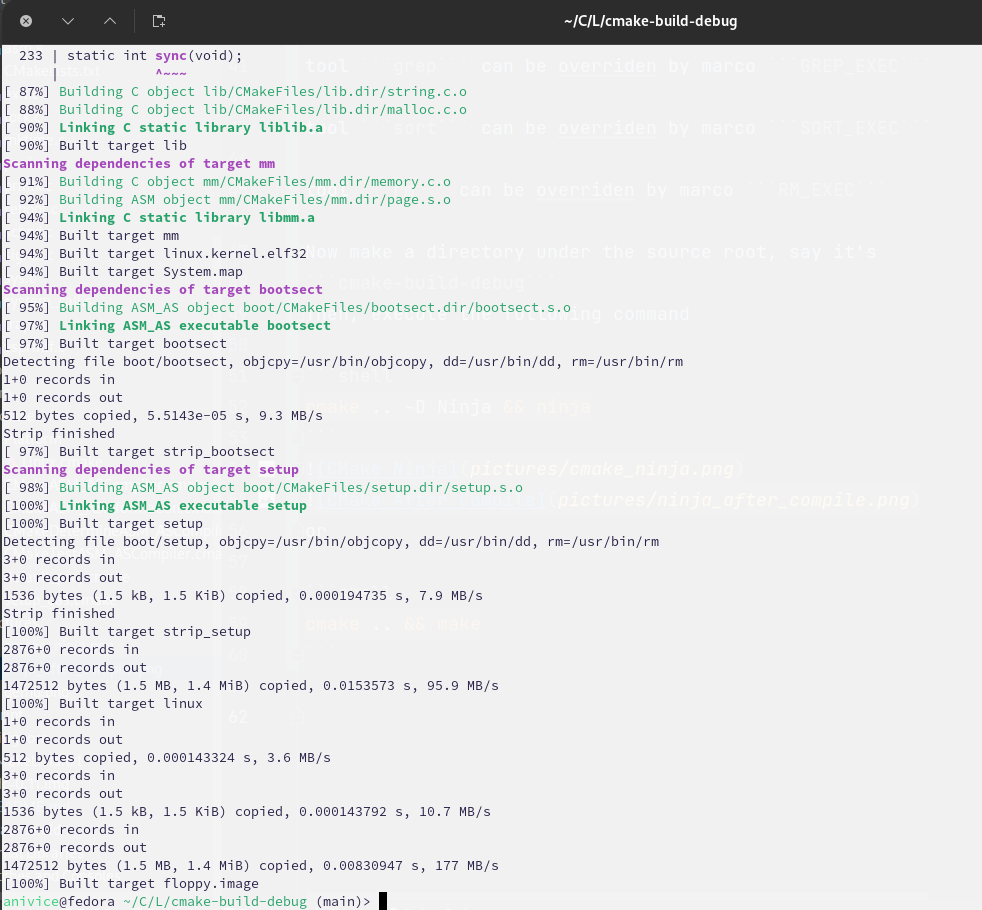

# Linux 0.12 meets modern build system

## Introduction

This is a highly modified Linux system (v0.12) used for
educational purposes only. Currently, it supports both
"Unix Makefiles" and "Ninja" build systems. Other build
systems are not tested, but they have a high possibility
of not working. Currently, this build is only tested
on Linux and other UNIX-Like systems, whether it's working on
Windows is not tested.

## Build the kernel

To build the kernel, you have to have the following tools
(or similar compatible tools)
```
dd cp as ld strip objcopy nm grep sort rm
```
The build system will search for the tools listed above
automatically, but you can also override the location of
the tools by appending CMake flags.
e.g. You can override ```dd``` executable with ```unix_dd``` by
using the following command
```shell
cmake -DDD_EXEC=unix_dd
```
tool ```dd``` can be overridden by Marco ```DD_EXEC```

tool ```cp``` can be overridden by Marco ```CP_EXEC```

tool ```as``` can be overridden by Marco ```GAS_EXEC```

tool ```ld``` can be overridden by Marco ```GLD_EXEC```

tool ```strip``` can be overridden by Marco ```STRIP_EXEC```

tool ```objcopy``` can be overridden by Marco ```OBJCPY_EXEC```

tool ```nm``` can be overridden by Marco ```NM_EXEC```

tool ```grep``` can be overridden by Marco ```GREP_EXEC```

tool ```sort``` can be overridden by Marco ```SORT_EXEC```

tool ```rm``` can be overridden by Marco ```RM_EXEC```

Now make a directory under the source root, say it's
```cmake-build-debug```
Then, execute the following command

```shell
cmake .. -D Ninja && ninja
```


or

```shell
cmake .. && make
```



This process will generate an ELF32 kernel file(```${KERNEL_NAME}.kernel.elf32```, 
default is ```linux.kernel.elf32```) with debug info
and a floppy disk image(```${FLOPPY_IMG_NAME}```, default is ```floppy.image```) 
that can be used for booting the system under the ```${CMAKE_BINARY_DIR}```

You can boot the system using the following command 
```shell
ninja qemu_boot
```
or
```shell
make qemu_boot
```

## Debug with QEMU

Say we have built the system using ninja. We can enable remote
debug using the following command
```shell
ninja qemu_debug
```

This will create gdb debug server at the address of localhost:9000
The symbol file for the kernel is under the ${CMAKE_BINARY_DIR},
which is the folder firstly created under the source root for
building the kernel.

### Debug with CLion using remote gdbserver

After this, all you have to do is connect the gdb to the server.
You can also have some advanced debugging tools like CLion up
and running.

Create a configuration of remote gdb debugging.
Click on CMake configurations and choose ```Edit Configurations ``


Then, proceed to click the '+' on the top left, choose ```Remote
Debug```


Then, fill the section 'target remote' args: with
```tcp:localhost:9000```, which is the address gdbserver will
be listening on.


Then, choose the kernel symbol file. By default, it's
```${CMAKE_BINARY_DIR}/linux.kernel.elf32```


After that, you can create breakpoints and debug in CLion,
which is extremely convenient.
